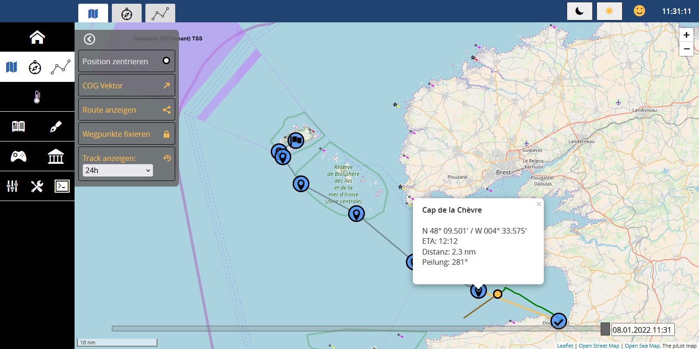
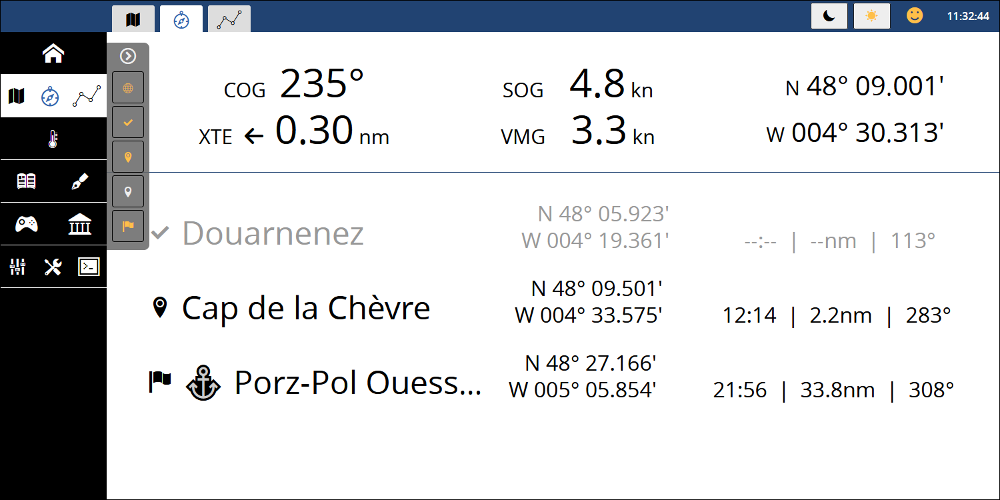
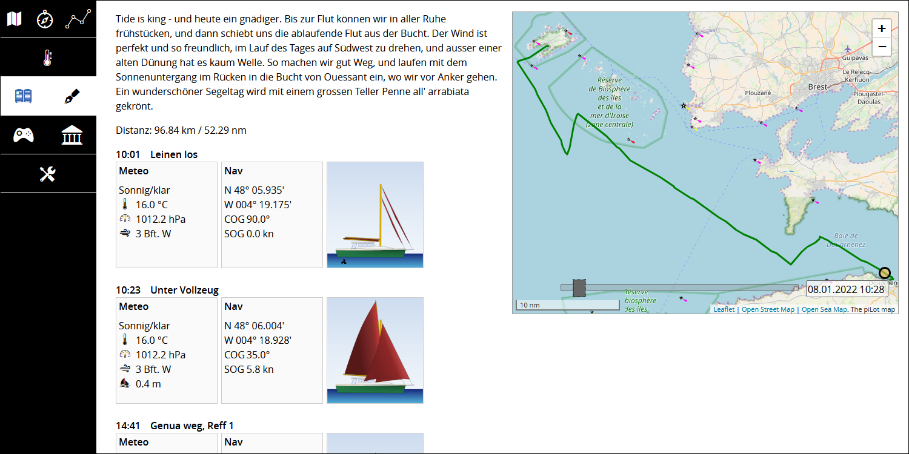
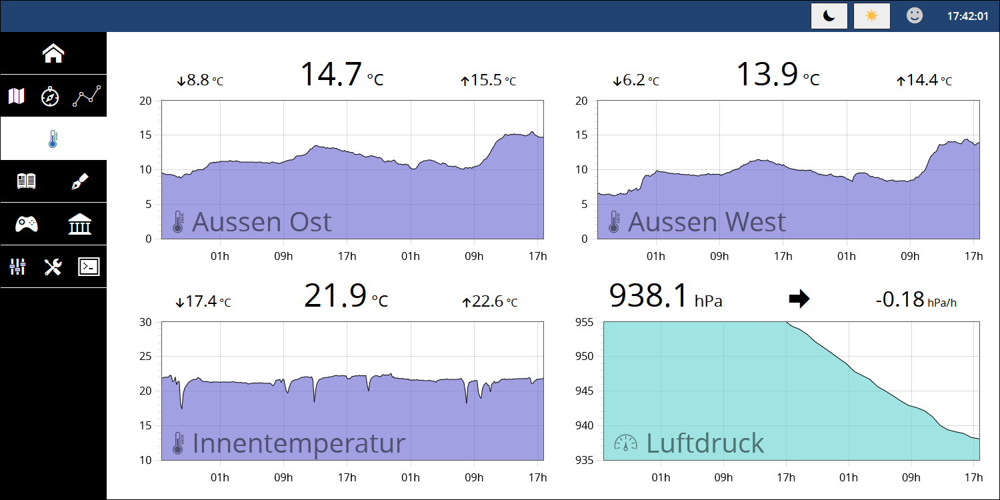
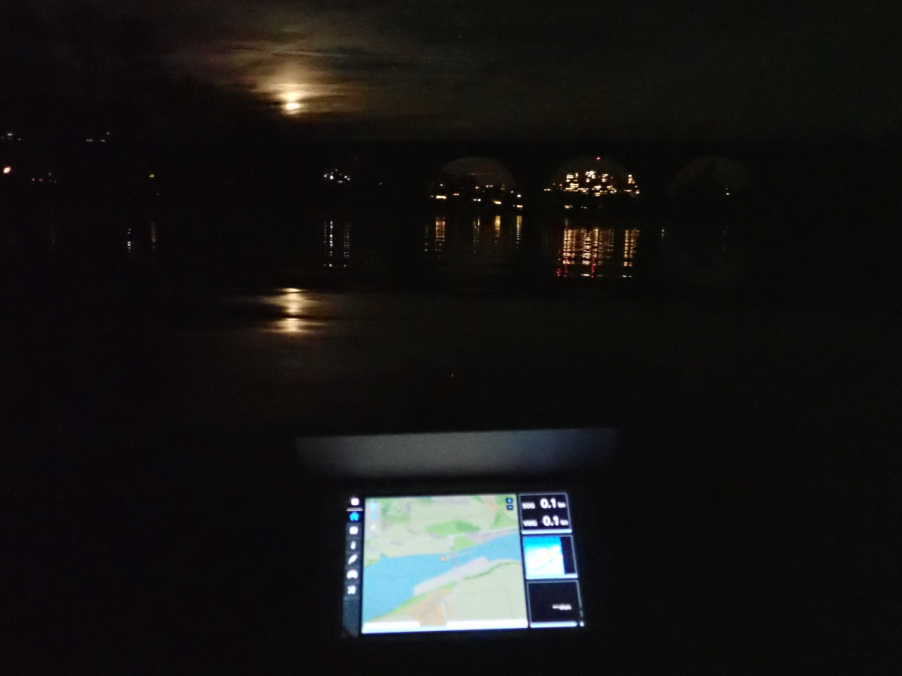

# PiLot

The PiLot is a Raspberry Pi based system used for boating. It's used with any device having a browser and wifi. It's completely autonomous and works perfectly without internet access. All data is fully controlled by the owner, as it's stored locally in simple formats and thus easily accessible.

## Features:

**Maps**
- Offline maps (osm and openseamap)
- GPS Position on the map
- Historic track on the map
- Course and speed over ground vector
- Waypoints on the map, showing distance, bearing and ETA

**Routes**
- Define an unlimited number of routes
- Each route can have any number of waypoints
- The route shows total distance, distance and bearing between each waypoint

**GPS data**
- Position
- COG (course over ground)
- SOG (speed over ground)
- VMG (velocity made good)
- XTE (cross track error)

**Logbook**
- Create logbook entries automatically fed with meteo and GPS data
- Select boat setup (engine, sails etc, freely configurable) for each logbook entry
- Create a logbook entry with one click, e.g. when leaving port or setting sails
- Visualize the boat setup with freely configurable boat images

**Diary**
- Show logbook, diary text, track and photos for one day on the diary page

**Meteo**
- Show actual and historic sensor data
- Temperature
- Air pressure, with 48h barograph and trend indicator
- Humidity
- Moon phase

**Entertainment**
- Games
- eBook library

**Other**
- Export track as gpx, csv, json or tabular data
- Download offline maps for any desired region and detail level
- Publish diary data to any other pilot
- Online live tracking
- Configurable Boattime (when moving from one timezone to the other)
- User management with specific permission levels
- Night mode
- Responsive user interface adapting to all sizes of screens

## Screenshots

Map with route, waypoint information, track, position and cog-vector:

Navigation data with waypoints:

Diary page:

Meteo page with all environment sensor data:

## Getting started 
### For users
If you have a bit of time and curiosity, you can set up your own PiLot at no cost (except
the hardware). You will end up having a free and open system to plan, track and relive your
adventures on the water. 

BE AWARE that **the PiLot does in no way replace neither reliable, professional navigation equipment
nor up-to-date charts.** The PiLot might be wrong, or might even fail entirely. 

See [Getting started for Users](docs/user.md) for further details.
### For developers
If you feel like contributing to the PiLot ecosystem, then you are more than welcome. It's just
HTML, vanilla Javascript and dotnet core with C#. No bloat, no frameworks, just straightworward
code. All you need is your favourite IDE, the dotnet SDK, a webserver (such as nginx) and git.
See [Getting started for developers](docs/dev.md) for further details.

Using the PiLot on a kayak at night (for those who can't afford a proper yacht):

