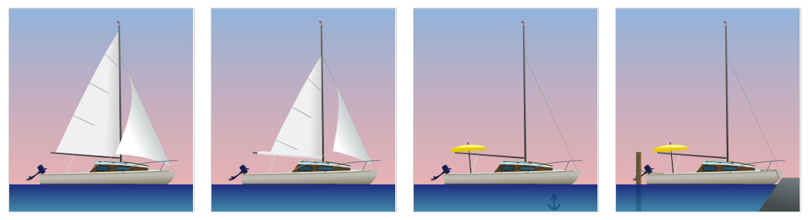
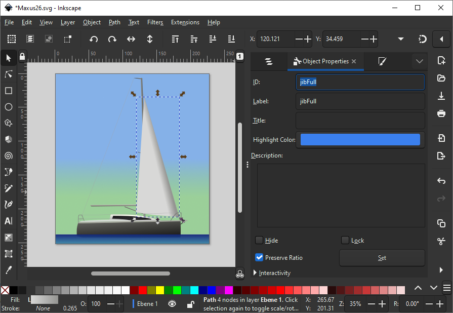

# PiLot - getting started
## Configure Your Boat

Well, this is going to be one last challenge. As you might have seen, the PiLot comes with some boats you can choose from (you do that on the settings page). Probably your boat will not be available yet, so you have to add it. A boat contains two elements:
- a SVG image
- a .json file defining the features of the boat, that can have different states (like the main sail, which can be set, in the first reef, second reef etc., or the engine, which can be on and off).

In each logbook entry, you can select the state of each feature of your boat. When having the sails set, you simply create a logbook entry having headsail and mainsail in the sate "set" and the engine in the state "off". This will show an image with this exact boat setup together with the logbook entry, which really looks nice.



In order to make the boat image show the correct boat setup, the features in the image (e.g. the main sail) need to be referenced by the features in the .json file of the boat. Well, let's just begin, you will grasp it.

To edit the SVG image, I recommend using [Inkscape](https://inkscape.org/), a very powerful yet not too hard to use drawing software.

You best start from one of the existing images that are found in the web directory at `/var/web/html/pilot/images`. The maxus26.svg is quite easy.

When you open the image in Inkscape, and select the jib (using the "layers and objects" window), you will see it has the ID-property set to "jibFull":



Looking at the .json file for this boat, which can be found in `/etc/pilot/boats/maxus26.json`, you will see two relevant element for the jib: First the definition of the feature with its different states in the "features" element:

```
"features": [
		...
		{
			"featureId": 2,
			"name": "Fock",
			"states": [
				{
					"name": "nicht gesetzt",
					"stateId": 1
				},
				{
					"name": "Gesetzt",
					"stateId": 2
				}
			]
		},
    ...
]
```

Second, the relation betweend the feature and the image in the featureGuis" element:

```
"featureGuis": [
		...
		{
			"featureId": 2,
			"guis": [
				{
					"stateId": 2,
					"svgObjectId": "jibFull"
				}
			]
		},
    ...
]
```

As you see, the feature (from above) is referenced by the "featureId", the state is referenced by the "stateId" and the object of the SVG image that has to be shown if the feature is in that certain stage is referenced by the "svgObjectId" (multiple values can be separated by semicolon;). 

The image itself, which is used for this boat, is referenced in the "boatImageUrl" element. The url must be relative to the web root.

That's basically it. All you have to do is take one of the existing boats, change the image until it represents your boat (it's easier if you add an actual photo in the background while you're drawing, and remove it at the end). Then create the corresponding .json file defining all the features, their states and the svg objects representing them. When done, you will be able to select your boat on the settings page, and when creating a logbook entry, choose the actual setup of your boat. 

Be aware that errors might occur, if you didn't properly match the items. You might get some information in the browser console.

There is more advanced stuff, like setting up a proper backup. Give it a try!

\> [Set up backup...](backup.md)

<< [Back to overview](user.md)
